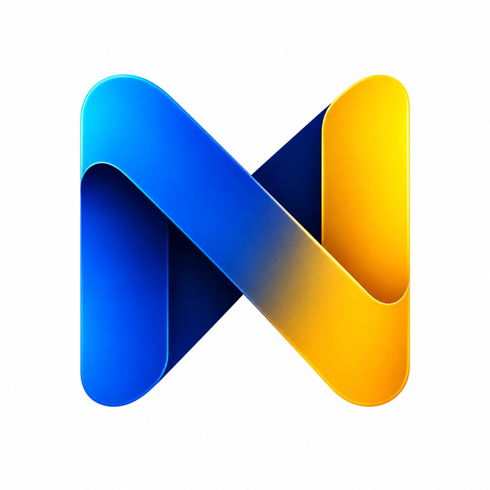

<p align="center">
  
</p>

<h1 align="center">Nova Motion</h1>

<p align="center">
  <em>An AI-powered video generation engine that turns a single prompt into finished, platform-ready videos — AI storyboards, Vox collage explainers, micro dramas, UGC ads, and motion graphics — rendered by Remotion.</em>
</p>

<p align="center">
  
  
  
  
  
  
  
  
</p>

<p align="center">
  
  
  
  
  
  
  
  
</p>

---

## What is Nova Motion?

Nova Motion merges several short-form video creation engines into a single Next.js API gateway and Express queue rendering backend. You submit a prompt and a composition mode; the pipeline writes the script, generates the AI visuals, narrates it, and renders the finished mp4 with Remotion.

All assets (voiceovers, background images, and final rendered videos) are automatically uploaded to DigitalOcean Spaces or Cloudflare R2, returning public URLs.

### Highlights

- **13 composition modes** — AI storyboards, stock shorts, typography slides, motion graphics, AI text-to-video, micro drama, UGC ads, agentic video, Luma Ray 3.2, and Vox collage explainers.
- **Agentic pipelines** — LLMs write scripts, cast characters, plan storyboards, and direct every shot inside the job queue.
- **Word-level kinetic captions** — ElevenLabs / Deepgram TTS narration with subtitles synced to the voiceover.
- **AI-generated assets** — Seedream collage posters, Seedance text/image-to-video clips, Lyria background music, and gpt-image illustrations.
- **Async job queue** — submit once, poll `GET /api/videos/{jobId}`, and get back a public mp4 URL.
- **Cloud-native storage** — local disk by default, DigitalOcean Spaces or Cloudflare R2 when configured.

### Project Structure

```text
├── src/                     # Next.js API gateway + Remotion compositions + studio UI
│   ├── app/                 #   API routes (POST /api/videos, GET /api/videos/:jobId, /ugc)
│   ├── lib/                 #   Generation pipelines (vox, wavespeed, luma, ugc, ...)
│   ├── remotion/            #   Remotion compositions (WavespeedVideo, ...)
│   └── components/          #   Studio UI components
├── render-server/           # Express queue rendering backend (headless Chromium)
│   ├── server.ts            #   POST /render/* endpoints
│   ├── renderer.ts          #   Pipeline dispatch + Remotion rendering
│   ├── queue.ts             #   Job queue state
│   └── storage.ts           #   Local / S3 storage layer
├── shared/                  # Shared request & response schemas
├── public/                  # Static assets (incl. the Nova Motion logo)
├── .env.local.example       # Every environment variable documented
└── package.json
```

---

## Video Generation Models (Compositions)

### 1. AI Storyboard Video (`videoType: "AIStoryboardVideo"`)
Produces highly engaging story videos in multiple aspect ratios (9:16, 16:9, 1:1) using gpt-image-2 image generation.
* **GPT-4o-mini**: Writes a narrative story script and detailed visual scene descriptions.
* **gpt-image-2**: Generates high-resolution illustrations for each scene.
* **Deepgram Aura TTS & Nova-2 STT**: Synthesizes natural narration and transcribes word-level offsets for kinetic subtitle alignments.

### 2. Stock Video Short (`videoType: "StockVideo"`)
Generates videos in multiple aspect ratios (9:16, 16:9, 1:1) by sourcing stock clips from Pexels.
* **GPT-4o-mini**: Writes the script and outputs context-based search keywords.
* **Pexels API**: Fetches relevant stock video loops.
* **Background Music**: Low-volume background tracks mixed under the voiceover.
* **Deepgram TTS + STT**: Narrates and maps word captions.

### 3. Stock Image Short (`videoType: "StockImage"`)
Generates videos in multiple aspect ratios (9:16, 16:9, 1:1) by sourcing stock images from Pixabay.
* **GPT-4o-mini**: Writes the script and outputs context-based search keywords.
* **Pixabay API**: Fetches relevant stock images.
* **Background Music**: Low-volume background tracks mixed under the voiceover.
* **Deepgram TTS + STT**: Narrates and maps word captions.

### 4. Typography/Layout Slide Videos (`videoType: "SocialMedia" | "Explainer" | "General" | "TextAnimation"`)
Clean layouts using modern typographic animations and styles.
* **Claude/OpenAI**: Writes structured JSON scripts defining slide colors, text, and timing.
* **Deepgram**: Overlays audio voiceovers.

### 5. Motion Graphics & Data Visualizations (`videoType: "MotionGraphics"`)
Produces premium, highly animated visual components using a dynamic, unified JSON slide renderer.
* **OpenAI (GPT-4o-mini)**: Generates a complete storyboard containing glitch/neon/wave text, bar/pie/line charts, growth metrics, and dynamic background layouts in strict JSON.
* **Deepgram & Background Music**: Synthesizes custom TTS narration for each slide and overlays background audio tracks.

### 6. AI Text-to-Video (`videoType: "TextToVideo"`)
Replicates the Text-To-Video-AI pipeline: generates the script, narrates it, then creates each B-roll segment with WaveSpeed's Seedance text-to-video model.
* **OpenAI (GPT-4o-mini)**: Writes a short facts-style script from the topic.
* **Deepgram/ElevenLabs TTS**: Narrates the script and returns native word-level timestamps.
* **WaveSpeed Seedance**: Generates an AI video clip per timed B-roll segment using the segment's visual keywords. Resolution via `WAVESPEED_VIDEO_RESOLUTION` (default `480p`), clip length via `WAVESPEED_VIDEO_DURATION` (default `5s`, 3–10s); segments are sized to match the clip length so nothing is wasted.
* **WaveSpeed Lyria**: Generates a cinematic background music bed (fallback to stock tracks).
* **Pexels Fallback**: If WaveSpeed clip generation fails for a segment, a matching Pexels stock clip is used instead.
* **Kinetic Captions**: The narration words are highlighted in sync with the voiceover.

### 7. Micro Drama (`videoType: "MicroDrama"`)
Replicates the Open-AI-Micro-Drama-Generator pipeline: a full agentic story-to-video workflow where the AI acts as screenwriter, casting director, storyboard artist, and cinematographer.
* **WaveSpeed LLM** (`WAVESPEED_LLM_MODEL`, default `deepseek/deepseek-v4-flash`): Writes the story from an idea (or consumes a supplied script), extracts consistent characters, writes per-scene scripts, and designs a shot-by-shot storyboard (visual + motion + audio descriptions).
* **WaveSpeed Seedream T2I**: Generates character portraits (`WAVESPEED_PORTRAIT_MODEL`) and a scene first-frame image per shot (`WAVESPEED_FRAME_MODEL`).
* **WaveSpeed Seedance I2V** (`WAVESPEED_I2V_MODEL`): Animates each shot's first-frame into a clip (default 5s, 720p) with **native audio** (ambient SFX — no TTS voiceover).
* **Two modes**: pass only `idea` (the AI writes the whole story) or pass a `script` (the raw script is used directly, skipping the screenwriter).
* **Async**: the request returns a `jobId` immediately; the whole pipeline runs inside the render job and is polled via `GET /api/videos/{jobId}`.

### 8. AI UGC Ad (`videoType: "UGC"`)
Replicates the Open-AI-UGC studio (an Arcads / MakeUGC alternative) using the **WaveSpeed** API already configured in this project — no separate MuAPI key needed.
* **Model picker**: Veo 3.1 (`google/veo3.1/*`), Seedance 2 (`bytedance/seedance-2.0/*`), Grok Video (`x-ai/grok-imagine-video/*`), and Happy Horse 1 (`alibaba/happyhorse-1.0/*`), each with text-to-video and image-to-video endpoints. Default model via `UGC_DEFAULT_MODEL` (default `seedance-2`).
* **T2V vs I2V**: with no reference images, the model's text-to-video endpoint is used; with reference image(s), the image-to-video endpoint animates the image (e.g. an actor face) with **native audio** from the script.
* **Reference images**: upload up to 7 images via `POST /api/upload` (returns a hosted URL) and reference them inline in the script as `@image1`, `@image2`, etc.
* **Per-model controls**: aspect ratio, duration, and resolution (Grok clips are 6 or 10s and limited to 16:9 / 1:1 / 9:16 per WaveSpeed's contract; no mode presets are available).
* **Multi-scene (Arcads-style)**: with `multiScene: true` the script is broken into 2-6 scenes by the WaveSpeed LLM following the UGC beat structure (**Hook → Problem → Product → Demo → Outcome → CTA**, kept honest — no fake testimonials/guarantees invented), a single TTS voiceover (ElevenLabs preferred, Deepgram fallback) is generated for the whole ad, each scene is generated as its own clip (I2V with a reference image to keep the same actor, T2V otherwise), and the clips are cut together into one timeline with kinetic captions — played by the `UGC` Remotion composition. `voice` selects the voiceover, `targetDurationSec` (10-60) hints the total length. **Lip-sync** (`lipSync`, default on) re-animates each clip's mouth to match the TTS via WaveSpeed `sync/lipsync-2` (~$0.05/run + ~2 min per scene, non-fatal fallback; requires the TTS audio to be publicly reachable via `RENDER_SERVER_BASE_URL`). Requires `ELEVENLABS_API_KEY` or `DEEPGRAM_API_KEY`.
* **Async**: the request returns a `jobId` immediately; the WaveSpeed generation runs inside the render job, the finished mp4 is downloaded into `rendered-videos/`, uploaded to S3/R2/Spaces when configured, and polled via `GET /api/videos/{jobId}`.
* **UI**: a full studio lives at `/ugc` (model cards, image upload with previews, **template library** with 18 proven UGC scripts — meal planning, beauty, SaaS, pet, local service, etc. — that load into the script box, param pickers, generation-style toggle, live polling player).

### 9. Agentic Video Generator (`videoType: "AgenticVideoGenerator"`)
Implements the end-to-end workflow described by the AI Video Generation Pipeline reference project, replacing its placeholder clients and fake output paths with the working services in this repository.
* **Production agents**: WaveSpeed LLM develops a screenplay, extracts characters, plans scenes, and writes visual, camera, and sound direction.
* **Character and scene generation**: WaveSpeed `bytedance/seedream-v5.0-pro` generates shot keyframes; verified video options are Seedance 2.0 (`bytedance/seedance-2.0/image-to-video`), Seedance 2.0 Fast (`bytedance/seedance-2.0-fast/image-to-video`), Veo 3.1 Fast Reference (`google/veo3.1-fast/reference-to-video`), MiniMax H3 Image-to-Video (`minimax/h3/image-to-video`), and MiniMax H3 Reference-to-Video (`minimax/h3/reference-to-video`).
* **Strict model execution**: this mode has no Pexels, stock, or alternate-provider fallback. It validates the selected model's ratios, duration, resolution, and reference-image limits before submission. A provider failure fails the job with the provider error.
* **Talking scenes**: when `lipSync` is enabled, ElevenLabs audio is sent to verified WaveSpeed `wavespeed-ai/infinitetalk`. No lip-sync fallback is used.
* **Assembly and export**: the generated clips are assembled by Remotion, persisted through the existing local/S3/R2 storage layer, and returned through the standard async job API.
* **Platform presets**: `youtube`, `linkedin`, and `standard` default to 16:9; `instagram_reels` and `tiktok` default to 9:16. An explicit `aspectRatio` overrides the platform preset.
* **Async**: the endpoint returns a `jobId` immediately. Poll `GET /api/videos/{jobId}` for progress and the final URL.

Verified payload constraints:
* Seedance I2V uses `prompt`, `image`, `aspect_ratio`, `resolution`, `duration` from 4-15 seconds, and `generate_audio`.
* Veo Fast Reference uses `prompt`, 1-3 `images`, `16:9` or `9:16`, `720p` or `1080p`, and fixed 8-second output.
* MiniMax H3 I2V uses `image`, `prompt`, `resolution: "2k"`, and duration from 5-15 seconds.
* MiniMax H3 Reference uses `prompt`, 1-9 `reference_images`, supported `aspect_ratio`, `resolution: "2k"`, and duration from 5-15 seconds.
* Seedream V5 Pro uses `prompt`, `aspect_ratio`, `resolution` of `1k` or `2k`, and `output_format` of `jpeg` or `png`.
* InfiniteTalk uses `image`, `audio`, optional `prompt`, `resolution` of `480p` or `720p`, and `seed`.

```json
{
  "videoType": "AgenticVideoGenerator",
  "title": "AI Manufacturing Copilot",
  "brief": "Introduce an AI copilot that helps factory teams diagnose downtime and improve throughput.",
  "targetAudience": "Manufacturing executives",
  "durationSeconds": 45,
  "language": "English",
  "tone": "Professional and optimistic",
  "keyMessages": ["Faster diagnosis", "Safer decisions", "Measurable throughput"],
  "callToAction": "Book a factory assessment",
  "platform": "linkedin",
  "style": "Premium industrial documentary, realistic lighting"
}
```

### 10. Luma AI Ray 3.2 (`videoType: "Luma"`)
Implements every core capability of Luma's Ray 3.2 model in a single unified mode with capability resolution, multi-scene screenplay planning, extend chaining, and layered ElevenLabs voiceover + kinetic captions.
* **All Ray 3.2 capabilities**: Text-to-Video, Image-to-Video (start/end frames & multi-keyframes up to 64 guide anchors), Seamless Loop, Forward Extend (`start_frame: { generation_id }`), Video Editing (`video_edit` with `adhere_1-3`, `flex_1-3`, `reimagine_1-3`), and Video Reframing (`video_reframe` with target aspect ratio and position controls).
* **Scenario templates**: Preconfigured prompts for UGC Product Posts, Product Showcase Ads, Product Launch Reveals, Real Estate Walkthroughs, Event Promos, Educational Tutorials, and Social Media Reels.
* **Extending vs Joining**: Seamlessly extends continuous takes using Luma `generation_id` chaining (`transition: "extend"`) or sequences distinct shots on the Remotion timeline (`transition: "cut"`).
* **Audio Layering**: Ray 3.2 generates silent video clips; the pipeline synthesizes narration with ElevenLabs TTS, extracts word timestamps, and overlays animated kinetic captions on the rendered video.
* **Async**: Returns a `jobId` immediately. Poll `GET /api/videos/{jobId}` for render status.

```json
{
  "videoType": "Luma",
  "prompt": "Show a futuristic smartwatch with holographic health metrics in action",
  "useCase": "product_ad",
  "aspectRatio": "16:9",
  "resolution": "720p",
  "duration": "5s",
  "generateAudio": true,
  "voice": "EXAVITQu4vr4xnSDxMaL"
}
```

### 11. Vox Collage Explainer (`videoType: "VoxVideo"`)
Replicates the Vox-style paper-collage explainer generator using the APIs already in this project.
* **Beat map**: A hook-led, arc-driven narrative structure (6 arcs) is written by the WaveSpeed LLM, with per-beat headlines, narration, scene specs, and element motion.
* **Collage posters**: Each beat is generated as a finished torn-paper collage poster by Seedream using a strict 5-part Vox prompt formula (style block, scene, background, headline banner, technical) across 4 visual themes (American Retro, Swiss Modern, Punk Zine, Chinese Ink).
* **Motion**: Each poster is animated into a clip by Seedance image-to-video using the beat's camera move + element-motion prompt.
* **Voice & captions**: ElevenLabs (preferred) / Deepgram TTS narration with word-level kinetic captions, plus optional Lyria background music — all assembled by the `WavespeedVideo` composition.
* **Async**: Returns a `jobId` immediately. Poll `GET /api/videos/{jobId}` for render status.

```json
{
  "videoType": "VoxVideo",
  "prompt": "A brief history of coffee",
  "theme": "american-retro",
  "arc": "timeline",
  "targetDurationSeconds": 30,
  "aspectRatio": "9:16",
  "generateAudio": true,
  "music": true
}
```

---

## Tech Stack
* **Framework**: Next.js 14, TypeScript, Tailwind CSS, shadcn/ui
* **AI Engines**: OpenAI (GPT-4o-mini, gpt-image-2), Deepgram (Aura TTS, Nova-2 STT), WaveSpeed (Seedance video, Lyria music)
* **Stock Sourcing**: Pexels Video API
* **Rendering**: Remotion Core, Express.js (render queue server)
* **Cloud Storage**: DigitalOcean Spaces / Cloudflare R2 (S3-compatible)

---

## Quick Start (Local Development)

### 1. Install Dependencies
```bash
npm install
```

### 2. Set Up Environment Variables
Create a `.env.local` file in the root of the project (copy from `.env.local.example`):
```env
# ============ AI API KEYS (Required) ============
# AIStoryboardVideo (gpt-4o-mini + gpt-image-2) + Luma LLM fallback
OPENAI_API_KEY=your-openai-api-key
# Primary TTS (native word timestamps) — used by almost every mode
ELEVENLABS_API_KEY=your-elevenlabs-api-key
# Fallback TTS + STT word timestamps when ElevenLabs is absent
DEEPGRAM_API_KEY=your-deepgram-api-key
# StockVideo mode (Pexels stock loops)
PEXELS_API_KEY=your-pexels-api-key
# StockImage mode (Pixabay stock images)
PIXABAY_API_KEY=your-pixabay-api-key
# TextToVideo, MicroDrama, UGC modes (Seedance/Seedream/Lyria) + Luma LLM fallback
WAVESPEED_API_KEY=your-wavespeed-api-key
# Luma mode (Ray 3.2 video generation)
LUMA_AGENTS_API_KEY=your-luma-agents-api-key

# ============ Render Server ============
RENDER_SERVER_URL=http://localhost:3001
RENDER_SERVER_BASE_URL=http://localhost:3001
RENDER_SERVER_SECRET=your-secret-string
RENDER_SERVER_PORT=3001
RENDER_CONCURRENCY=2
NEXT_PUBLIC_APP_URL=http://localhost:3000

# ============ WaveSpeed model defaults (optional) ============
WAVESPEED_VIDEO_MODEL=bytedance/seedance-v1-pro-fast/text-to-video
WAVESPEED_VIDEO_RESOLUTION=480p
WAVESPEED_VIDEO_DURATION=5
WAVESPEED_LLM_MODEL=deepseek/deepseek-v4-flash
WAVESPEED_IMAGE_MODEL=bytedance/seedream-v4.5
WAVESPEED_PORTRAIT_MODEL=bytedance/seedream-v4.5
WAVESPEED_FRAME_MODEL=bytedance/seedream-v4.5
WAVESPEED_I2V_MODEL=bytedance/seedance-2.0/image-to-video
UGC_DEFAULT_MODEL=seedance-2

# ============ Luma LLM defaults (optional) ============
LUMA_LLM_URL=https://llm.wavespeed.ai/v1/chat/completions
LUMA_LLM_MODEL=deepseek/deepseek-v4-flash

# ============ Storage (optional — local disk fallback) ============
# DigitalOcean Spaces
SPACES_ENDPOINT=https://nyc3.digitaloceanspaces.com
SPACES_KEY=your-do-access-key
SPACES_SECRET=your-do-secret-key
SPACES_BUCKET_NAME=your-bucket-name
SPACES_PUBLIC_URL=https://your-custom-cdn.com
# Cloudflare R2 (alternative)
R2_ACCOUNT_ID=your-r2-account-id
R2_ACCESS_KEY_ID=your-r2-access-key-id
R2_SECRET_ACCESS_KEY=your-r2-secret-access-key
R2_BUCKET_NAME=your-bucket-name
R2_PUBLIC_URL=https://your-account-id.r2.dev/your-bucket-name
R2_DELETE_LOCAL_AFTER_UPLOAD=false
```

A complete reference with per-key comments and setup links lives in `.env.local.example`. Each API key unlocks the modes it documents above; without a key the corresponding mode returns an error at submission time.

### 3. Start the Render Server
The rendering backend handles the queue and runs chromium in headless mode to render the video files.
```bash
npm run render-server
```

### 4. Start the Next.js API Gateway
In a new terminal:
```bash
npm run dev
```

---

## API Documentation

### 1. Generate Video (`POST /api/videos`)
Submits a prompt to generate and render a new video.

#### Request Parameters
All endpoints support the following root payload fields:
* **`prompt`** (string, required): The core instruction, script, topic, or concept to generate.
* **`videoType`** (string, required): The video template mode. Must be one of:
  * `"AIStoryboardVideo"`: AI Storyboard mode (gpt-image-2 images + voiceover).
  * `"StockVideo"`: Pexels stock footage mode (stock video loops + voiceover).
  * `"StockImage"`: Pixabay stock image mode (stock images + voiceover).
  * `"SocialMedia"`: Kinetic typographic slide style (quotes/shorts).
  * `"Explainer"`: Multi-step layout slides supporting step numbers.
  * `"General"`: Simple slide layout transitions.
  * `"TextAnimation"`: Words with active highlighting animations.
  * `"MotionGraphics"`: Dynamic motion graphics, charts, and interactive UI component simulations.
  * `"TextToVideo"`: AI-generated B-roll from WaveSpeed Seedance + TTS voiceover (Text-To-Video-AI replication).
  * `"MicroDrama"`: Full agentic pipeline — AI story, characters, storyboard, and Seedance I2V clips (Open-AI-Micro-Drama-Generator replication).
  * `"UGC"`: AI UGC ad studio — script + optional reference images → Veo/Grok/Seedance/Happy Horse clip with native audio (Open-AI-UGC replication via WaveSpeed).
  * `"AgenticVideoGenerator"`: Concept to screenplay, casting, storyboard, AI scenes, audio, and platform-ready video.
  * `"Luma"`: Unified Luma Ray 3.2 mode — text-to-video, image-to-video, loop, extend, video edit, reframe + TTS voiceover & kinetic captions.
  * `"VoxVideo"`: Vox-style paper-collage explainer — LLM beat map → Seedream collage posters → Seedance animated clips + TTS voiceover, captions & music.
* **`aspectRatio`** (string, optional): Target video layout format. Must be one of:
  * `"9:16"`: Portrait (mobile vertical) - defaults to `1080x1920`.
  * `"16:9"`: Landscape (widescreen desktop) - defaults to `1920x1080`.
  * `"1:1"`: Square (social feed block) - defaults to `1080x1080`.
* **`durationSec`** (number, optional): Target video duration (under 45 seconds is recommended).
* **`topic`** (string, optional): Context topic used to direct scriptwriting style.
* **`voice`** (string, optional): Deepgram voice key to customize narrator voice (e.g., `"aura-2-aries-en"`, `"aura-2-arcas-en"`, `"aura-2-luna-en"`).
* **`style`** (object, optional): Global branding override parameters:
  * `primaryColor` (string): Background or primary element hex code (e.g. `"#020617"`).
  * `secondaryColor` (string): Accent highlight hex code (e.g. `"#38bdf8"`).
  * `textColor` (string): Slide foreground text hex code (e.g. `"#ffffff"`).

---

#### Endpoint A: AI Storyboard Video (`videoType: "AIStoryboardVideo"`)
Produces animated vertical or landscape shorts using **`gpt-image-2`** base64 illustration generation and Deepgram TTS voiceover.
* **Example Payload**:
  ```json
  {
    "prompt": "The mystery of the Oak Island money pit",
    "videoType": "AIStoryboardVideo",
    "topic": "History",
    "aspectRatio": "16:9",
    "voice": "aura-2-aries-en"
  }
  ```

#### Endpoint B: Stock Video Short (`videoType: "StockVideo"`)
Produces shorts using context-matched Pexels stock video footage, Deepgram TTS voiceover, and background music overlays.
* **Example Payload**:
  ```json
  {
    "prompt": "Top 3 healthy habits for programmers",
    "videoType": "StockVideo",
    "topic": "Health",
    "aspectRatio": "16:9",
    "voice": "aura-2-arcas-en"
  }
  ```

#### Endpoint C: Stock Image Short (`videoType: "StockImage"`)
Produces shorts using context-matched Pixabay stock images, Deepgram TTS voiceover, and background music overlays.
* **Example Payload**:
  ```json
  {
    "prompt": "Why reading daily is key to success",
    "videoType": "StockImage",
    "topic": "Education",
    "aspectRatio": "9:16",
    "voice": "aura-2-aries-en"
  }
  ```

#### Endpoint D: Typographic Slide Videos (`videoType` Options: `"SocialMedia" | "Explainer" | "General" | "TextAnimation"`)
Outputs animated text slides with dynamic TTS voiceover. Layout automatically adapts font dimensions to the target aspect ratio.
* **Example Payload**:
  ```json
  {
    "prompt": "A quote by Steve Jobs about design",
    "videoType": "SocialMedia",
    "durationSec": 15,
    "aspectRatio": "1:1",
    "style": {
      "primaryColor": "#0f172a",
      "textColor": "#38bdf8"
    }
  }
  ```

#### Endpoint E: Motion Graphics & Data Visualizations (`videoType: "MotionGraphics"`)
Generates highly animated technical slides with data visualization layouts (bar charts, pie charts) and animated typography (badges, glitch text, large stats) driven by a self-contained JSON schema.
* **Example Payload**:
  ```json
  {
    "prompt": "Show a comparison of the top 3 programming languages in 2026",
    "videoType": "MotionGraphics",
    "topic": "Programming",
    "aspectRatio": "9:16",
    "voice": "aura-2-aries-en"
  }
  ```

#### Endpoint F: AI Text-to-Video (`videoType: "TextToVideo"`)
Generates a facts-style short using WaveSpeed Seedance AI clips for every timed B-roll segment, WaveSpeed Lyria background music, and kinetic word-level captions synced to the TTS voiceover.
* **Requires `WAVESPEED_API_KEY`** (add to `.env.local`). Uses the `WAVESPEED_VIDEO_MODEL` model (default: `bytedance/seedance-v1-pro-fast/text-to-video`).
* **Async**: Unlike other modes, the request returns immediately with a `jobId`. The script → TTS → WaveSpeed clips → music pipeline runs inside the render job on the render server; poll `GET /api/videos/{jobId}` for progress.
* **Example Payload**:
  ```json
  {
    "prompt": "Weird facts you don't know about the deep ocean",
    "videoType": "TextToVideo",
    "topic": "Marine Biology",
    "aspectRatio": "9:16",
    "voice": "aura-2-aries-en"
  }
  ```

#### Endpoint G: Micro Drama (`videoType: "MicroDrama"`)
Generates a micro-drama video through the full agentic pipeline. Pass just an `idea` (story is written for you) or include a `script` to use your own text directly. Optional `style` guides the visual style and `requirement` adds extra constraints (e.g. runtime, mood).
* **Requires `WAVESPEED_API_KEY`**. Uses `WAVESPEED_LLM_MODEL` (default `deepseek/deepseek-v4-flash`), `WAVESPEED_PORTRAIT_MODEL`/`WAVESPEED_FRAME_MODEL` (default `bytedance/seedream-v4.5`), and `WAVESPEED_I2V_MODEL` (default `bytedance/seedance-2.0/image-to-video`).
* **Async**: returns a `jobId` immediately; the story → characters → scene scripts → storyboard → portraits → frames → I2V clips → render pipeline runs inside the job. Each AI clip takes ~1-2 minutes, so poll `GET /api/videos/{jobId}` until `status` is `completed`.
* **Example Payload (idea only)**:
  ```json
  {
    "videoType": "MicroDrama",
    "idea": "A detective in a rainy city discovers his partner was the mastermind all along",
    "style": "Noir thriller, cold color grade, dramatic shadows",
    "requirement": "Keep the story under 45 seconds with a twist ending",
    "aspectRatio": "16:9"
  }
  ```
* **Example Payload (with script — script2video mode)**:
  ```json
  {
    "videoType": "MicroDrama",
    "idea": "A detective in a rainy city discovers his partner was the mastermind all along",
    "script": "INT. PRECINCT - NIGHT\nDetective Mara stares at the evidence board...",
    "style": "Noir thriller, cold color grade, dramatic shadows"
  }
  ```

#### Endpoint H: AI UGC Ad (`videoType: "UGC"`)
Generates a UGC ad through WaveSpeed using any of the studio models (Veo 3.1, Seedance 2, Grok Video, Happy Horse 1). `prompt` is the script (reference images inline as `@image1`...). Optional `images` (hosted URLs from `POST /api/upload`) switches to image-to-video. `model`, `aspectRatio`, `duration`, and `resolution` mirror the studio controls.
* **Requires `WAVESPEED_API_KEY`**. Default model via `UGC_DEFAULT_MODEL` (default `seedance-2`).
* **Multi-scene** (`multiScene: true`): the WaveSpeed LLM breaks the script into 2-6 scenes, one TTS voiceover covers the whole ad (`voice` picks it, default auto), each scene is generated as its own clip (I2V with a reference image keeps the same actor), and the clips are assembled into a single timeline with kinetic captions. `targetDurationSec` (10-60) hints total length. **Lip-sync** (`lipSync`, default on) warps each clip's mouth to the TTS via WaveSpeed `sync/lipsync-2`; set `lipSync: false` to skip it for cost/speed. Requires `ELEVENLABS_API_KEY` or `DEEPGRAM_API_KEY`.
* **Async**: returns a `jobId` immediately; the WaveSpeed generation runs inside the job and the finished mp4 is persisted to storage. Poll `GET /api/videos/{jobId}` until `status` is `completed`.
* **UI**: full studio at `/ugc` — model cards, reference image upload, script box, param pickers, generation-style toggle, live polling player.
* **Example Payload (text-to-video)**:
  ```json
  {
    "videoType": "UGC",
    "prompt": "Hey! Here are 3 skincare mistakes you're making every morning. First, you're washing your face with hot water...",
    "model": "veo-3-1",
    "aspectRatio": "9:16",
    "duration": 8,
    "resolution": "1080p"
  }
  ```
* **Example Payload (multi-scene)**:
  ```json
  {
    "videoType": "UGC",
    "prompt": "Tired of brittle nails? Here's the 3-step routine I swear by... grab this kit while it's 40% off.",
    "model": "seedance-2",
    "images": ["https://your-bucket.nyc3.digitaloceanspaces.com/images/actor.jpg"],
    "aspectRatio": "9:16",
    "resolution": "1080p",
    "multiScene": true,
    "voice": "pNInz6obpgDQGcFmaJgB",
    "targetDurationSec": 30
  }
  ```
* **Example Payload (image-to-video with a reference face)**:
  ```json
  {
    "videoType": "UGC",
    "prompt": "@image1 here with the best hack for your morning routine. Trust me, this changes everything...",
    "model": "grok-video",
    "images": ["https://your-bucket.nyc3.digitaloceanspaces.com/images/abc123.jpg"],
    "aspectRatio": "9:16",
    "duration": 6
  }
  ```

---

### Exact JSON Request Payloads for All Video Modes
All requests must be sent as `POST` requests to:
`http://localhost:3000/api/videos`

#### 1. AI Storyboard Video (`AIStoryboardVideo`)
```json
{
  "prompt": "Explain how black holes are formed in space",
  "videoType": "AIStoryboardVideo",
  "topic": "Space Science",
  "aspectRatio": "16:9",
  "voice": "aura-2-aries-en"
}
```

#### 2. Stock Footage Video (`StockVideo`)
```json
{
  "prompt": "Why drinking water in the morning improves focus",
  "videoType": "StockVideo",
  "topic": "Wellness & Health",
  "aspectRatio": "16:9",
  "voice": "aura-2-arcas-en"
}
```

#### 3. Stock Image Video (`StockImage`)
```json
{
  "prompt": "Why reading daily is key to success",
  "videoType": "StockImage",
  "topic": "Education",
  "aspectRatio": "9:16",
  "voice": "aura-2-aries-en"
}
```

#### 4. Social Media Typography Slide (`SocialMedia`)
```json
{
  "prompt": "A short piece of advice about starting a business today",
  "videoType": "SocialMedia",
  "aspectRatio": "9:16",
  "durationSec": 15,
  "style": {
    "primaryColor": "#020617",
    "textColor": "#38bdf8"
  }
}
```

#### 5. Explainer Presentation Slide (`Explainer`)
```json
{
  "prompt": "3 steps to write clean code",
  "videoType": "Explainer",
  "aspectRatio": "16:9",
  "durationSec": 20,
  "style": {
    "primaryColor": "#1e1b4b",
    "textColor": "#818cf8"
  }
}
```

#### 6. General Slide Layout (`General`)
```json
{
  "prompt": "A description of the scale of the solar system",
  "videoType": "General",
  "aspectRatio": "1:1",
  "durationSec": 15,
  "style": {
    "primaryColor": "#172554",
    "textColor": "#f8fafc"
  }
}
```

#### 7. Text Animation / Kinetic Highlight (`TextAnimation`)
```json
{
  "prompt": "A high energy quote about doing your best work",
  "videoType": "TextAnimation",
  "aspectRatio": "9:16",
  "durationSec": 12,
  "style": {
    "primaryColor": "#000000",
    "textColor": "#ffffff"
  }
}
```

#### 8. Motion Graphics Video (`MotionGraphics`)
```json
{
  "prompt": "Show a comparison of the top 3 programming languages in 2026",
  "videoType": "MotionGraphics",
  "topic": "Programming",
  "aspectRatio": "9:16",
  "voice": "aura-2-aries-en"
}
```

#### 9. AI Text-to-Video (`TextToVideo`)
```json
{
  "prompt": "Weird facts you don't know about the deep ocean",
  "videoType": "TextToVideo",
  "topic": "Marine Biology",
  "aspectRatio": "9:16",
  "voice": "aura-2-aries-en"
}
```

* **Requires** `WAVESPEED_API_KEY` in `.env.local`. The B-roll model defaults to `bytedance/seedance-v1-pro-fast/text-to-video` and can be overridden with `WAVESPEED_VIDEO_MODEL`. This mode is **async**: the request returns a `jobId` immediately and the render server generates the whole pipeline (script → TTS → WaveSpeed clips → music) inside the job, reporting progress as it goes. Because each AI clip takes ~1-2 minutes to generate, the job stays in the `rendering` state for several minutes — poll `GET /api/videos/{jobId}` until `status` is `completed`.

* **Response**:
  ```json
  {
    "success": true,
    "jobId": "a1b2c3d4-e5f6-7a8b-9c0d-e1f2a3b4c5d6",
    "status": "queued",
    "createdAt": "2026-07-01T18:00:00.000Z"
  }
  ```

#### 10. Micro Drama (`MicroDrama`)
```json
{
  "videoType": "MicroDrama",
  "idea": "A detective in a rainy city discovers his partner was the mastermind all along",
  "style": "Noir thriller, cold color grade, dramatic shadows",
  "requirement": "Keep the story under 45 seconds with a twist ending",
  "aspectRatio": "16:9"
}
```

* **Requires** `WAVESPEED_API_KEY` in `.env.local`. Replicates the Open-AI-Micro-Drama-Generator pipeline: the WaveSpeed LLM writes the story (or uses a supplied `script`), extracts consistent characters, generates per-scene scripts, and designs a shot-by-shot storyboard; Seedream generates character portraits and scene first-frames; Seedance I2V animates each frame into a ~5s clip with native audio. This mode is **async** like TextToVideo — submit and poll `GET /api/videos/{jobId}`. Model defaults can be overridden with `WAVESPEED_LLM_MODEL`, `WAVESPEED_PORTRAIT_MODEL`, `WAVESPEED_FRAME_MODEL`, and `WAVESPEED_I2V_MODEL`.

* **Response** (same shape as TextToVideo):
  ```json
  {
    "success": true,
    "jobId": "a1b2c3d4-e5f6-7a8b-9c0d-e1f2a3b4c5d6",
    "status": "queued",
    "createdAt": "2026-07-01T18:00:00.000Z"
  }
  ```

#### 11. AI UGC Ad (`UGC`)
```json
{
  "videoType": "UGC",
  "prompt": "Hey! @image1 here with the best hack for your morning routine. Trust me, this changes everything...",
  "model": "veo-3-1",
  "images": ["https://your-bucket.nyc3.digitaloceanspaces.com/images/abc123.jpg"],
  "aspectRatio": "9:16",
  "duration": 8,
  "resolution": "1080p"
}
```

* **Requires** `WAVESPEED_API_KEY` in `.env.local`. Replicates the Open-AI-UGC studio: choose a model (`veo-3-1` | `seedance-2` | `grok-video` | `happy-horse`), optionally upload reference images, and pass a script that references them with `@imageN`. With images the model's image-to-video endpoint is used (I2V); without them, text-to-video (T2V). Native audio is generated by the video model (the AI actor speaks). Model defaults can be overridden with `UGC_DEFAULT_MODEL`. The finished mp4 is persisted to storage (S3/R2/Spaces when configured). **Async** — submit and poll `GET /api/videos/{jobId}`. A full studio UI is available at `/ugc`.

* **Response** (same shape as TextToVideo):
  ```json
  {
    "success": true,
    "jobId": "a1b2c3d4-e5f6-7a8b-9c0d-e1f2a3b4c5d6",
    "status": "queued",
    "createdAt": "2026-07-01T18:00:00.000Z"
  }
  ```

#### 12. Luma Ray 3.2 Video (`Luma`)
The `Luma` mode automatically detects the right Ray 3.2 endpoint based on the media attachments you provide, or you can set `explicitOperation` manually. If `useCase` is omitted, it defaults to `"custom"` and generates video directly.

##### Example A: Text-to-Video / Multi-Scene Ad (Scenario Picker)
```json
{
  "videoType": "Luma",
  "prompt": "Create a high-energy product launch ad for a sleek espresso machine",
  "useCase": "product_launch",
  "aspectRatio": "16:9",
  "resolution": "720p",
  "duration": "5s",
  "generateAudio": true,
  "voice": "EXAVITQu4vr4xnSDxMaL"
}
```

##### Example B: Image-to-Video with Image Attachments (`referenceImages`)
Animates uploaded images as starting/guide keyframes:
```json
{
  "videoType": "Luma",
  "prompt": "Animate this product photo with gentle steam rising and soft lighting movement",
  "referenceImages": ["https://your-cdn.com/product-photo.jpg"],
  "explicitOperation": "image_to_video",
  "aspectRatio": "9:16",
  "resolution": "1080p",
  "duration": "5s"
}
```

##### Example C: Video Editing / Restyling Uploaded Video (`sourceVideoUrl`)
Re-renders an uploaded video clip under a new prompt and edit strength (`adhere_1-3`, `flex_1-3`, `reimagine_1-3`):
```json
{
  "videoType": "Luma",
  "prompt": "Transform this video into a moonlit cyberpunk scene with neon highlights",
  "sourceVideoUrl": "https://your-cdn.com/user-footage.mp4",
  "explicitOperation": "edit",
  "editStrength": "flex_2",
  "resolution": "720p"
}
```

##### Example D: Video Reframing / Outpainting (`sourceVideoUrl` + `aspectRatio`)
Outpaints an existing video into a new platform-native shape (e.g., 16:9 landscape $\rightarrow$ 9:16 vertical Reel):
```json
{
  "videoType": "Luma",
  "prompt": "Extend the background into cinematic vertical portrait space",
  "sourceVideoUrl": "https://your-cdn.com/landscape-clip.mp4",
  "explicitOperation": "reframe",
  "aspectRatio": "9:16",
  "resolution": "720p"
}
```

* **Requires** `LUMA_AGENTS_API_KEY` in `.env.local`. Dispatches to Luma's Ray 3.2 API (`agents.lumalabs.ai`). Automatically handles single-shot operations or multi-scene screenplay planning with extend chaining (`start_frame: { generation_id }`) and layered ElevenLabs TTS + kinetic word-level captions.
* **Default Behavior**: When no `useCase` is passed, it defaults to `"custom"` (pure prompt generation). When media attachments (`sourceVideoUrl` / `referenceImages`) are attached without an `explicitOperation`, it auto-detects the right operation (`edit` for video files, `image_to_video` for images).
* **Async** — returns a `jobId` immediately; poll `GET /api/videos/{jobId}` until completed.

* **Response**:
  ```json
  {
    "success": true,
    "jobId": "a1b2c3d4-e5f6-7a8b-9c0d-e1f2a3b4c5d6",
    "status": "queued",
    "createdAt": "2026-07-01T18:00:00.000Z"
  }
  ```

#### 13. Vox Collage Explainer (`VoxVideo`)
Replicates the Vox-style paper-collage explainer generator on top of the APIs this project already uses. A single topic flows through: **LLM narrative beat map** (hook-led, arc-driven, cadence every ~4-6s) → one **Seedream collage poster** per beat (strict 5-part Vox prompt formula + theme preset) → **Seedance I2V** animates each poster into a clip → **ElevenLabs/Deepgram TTS** voiceover with kinetic word captions → optional **Lyria** background music → assembled by the `WavespeedVideo` Remotion composition into a finished mp4.

```json
{
  "videoType": "VoxVideo",
  "prompt": "A brief history of coffee",
  "theme": "american-retro",
  "arc": "timeline",
  "targetDurationSeconds": 30,
  "aspectRatio": "9:16",
  "generateAudio": true,
  "music": true
}
```

* **Themes** (`theme`): `swiss-modern` · `american-retro` · `punk-zine` · `chinese-ink` (default `american-retro`).
* **Arcs** (`arc`): `hook_payoff` · `timeline` · `how_it_works` · `pas` · `bab` · `man_in_hole` (default `hook_payoff`).
* **Requires** `WAVESPEED_API_KEY` (posters + clips + music) and a TTS key (`ELEVENLABS_API_KEY` preferred or `DEEPGRAM_API_KEY`). The beat-map LLM uses `VOX_LLM_URL`/`VOX_LLM_MODEL` (defaults to the WaveSpeed LLM, fallback key `OPENAI_API_KEY`).
* **Async** — returns a `jobId` immediately; poll `GET /api/videos/{jobId}` until completed.

* **Response**:
  ```json
  {
    "success": true,
    "jobId": "a1b2c3d4-e5f6-7a8b-9c0d-e1f2a3b4c5d6",
    "status": "queued",
    "createdAt": "2026-07-01T18:00:00.000Z"
  }
  ```

---

### API Modes: Generate vs. Direct Render

The endpoint `POST /api/videos` operates in two distinct modes depending on your payload structure:

#### A. Generate Mode (AI Auto-styling)
If you only supply a `"prompt"`, OpenAI will dynamically write the script or timeline. You can pass optional **`style` overrides** to guide the AI's aesthetic choices.

Additionally, you can specify a consistent **`voice`** parameter to narrate the entire video. If omitted, the API will randomly pick a single voice and use it consistently for all scenes of that video.

* **Supported Voices**: `"aura-2-thalia-en"`, `"aura-2-andromeda-en"`, `"aura-2-arcas-en"`, `"aura-2-aries-en"`

```json
{
  "prompt": "A quote by Steve Jobs about design",
  "videoType": "SocialMedia",
  "voice": "aura-2-thalia-en",     // Optional premium Aura-2 voice override
  "style": {
    "primaryColor": "#0f172a",    // Guide AI to use slate blue backgrounds
    "textColor": "#38bdf8"       // Guide AI to use light blue text
  }
}
```

#### B. Direct Render Mode (Full Custom Control)
If you want to design a custom editor interface where the user manually controls every slide (timing, background color, text color, individual animations, and voiceover audio files), you can submit a fully pre-defined `script` or `timeline` object. In this mode, the server skips OpenAI completely and renders the exact parameters provided:
```json
{
  "videoType": "SocialMedia",
  "script": {
    "title": "Manual Quote",
    "durationSec": 10,
    "fps": 30,
    "width": 1080,
    "height": 1920,
    "scenes": [
      {
        "text": "Design is not just what it looks like.",
        "startSec": 0,
        "durationSec": 5,
        "bgColor": "#1e1b4b",
        "textColor": "#facc15",
        "fontSize": 64,
        "animation": "bounce",
        "audioUrl": "/assets-temp/scene-0.mp3"
      },
      {
        "text": "Design is how it works.",
        "startSec": 5,
        "durationSec": 5,
        "bgColor": "#020617",
        "textColor": "#38bdf8",
        "fontSize": 64,
        "animation": "typewriter",
        "audioUrl": "/assets-temp/scene-1.mp3"
      }
    ]
  }
}
```

#### C. Direct Render Mode for Motion Graphics (`timeline`)
For `MotionGraphics`, you provide a `timeline` object instead of a `script` object, specifying dynamic `slides`:
```json
{
  "videoType": "MotionGraphics",
  "timeline": {
    "shortTitle": "Manual Motion Graphics",
    "slides": [
      {
        "durationFrames": 120,
        "background": {
          "type": "mesh",
          "from": "#0a0a0a",
          "to": "#1a1a2e"
        },
        "elements": [
          { "type": "badge", "text": "INTRODUCTION", "color": "#00ffd2", "delay": 0 },
          { "type": "title", "text": "AI Revolution", "animation": "slideUp", "color": "#ffffff", "delay": 15 },
          { "type": "subtitle", "text": "Changing the world", "color": "#a1a1aa", "delay": 30 }
        ]
      }
    ]
  }
}
```

---

### 2. Get Video Link / Job Status (`GET /api/videos/:jobId`)
Polls the render queue status. Once rendering is completed, it uploads the final `.mp4` file to your S3 storage bucket and returns the public link.

* **Response (completed)**:
  ```json
  {
    "jobId": "a1b2c3d4-e5f6-7a8b-9c0d-e1f2a3b4c5d6",
    "status": "completed",
    "progress": 100,
    "videoUrl": "https://your-spaces-bucket.nyc3.digitaloceanspaces.com/videos/a1b2c3d4-e5f6-7a8b-9c0d-e1f2a3b4c5d6.mp4",
    "createdAt": "2026-06-30T04:30:00.000Z",
    "startedAt": "2026-06-30T04:30:05.000Z",
    "completedAt": "2026-06-30T04:30:50.000Z"
  }
  ```

---

## Troubleshooting

### Render server cannot connect
* Ensure the render server is running on port `3001` (`npm run render-server`).
* If deploying, verify your Cloudflare Tunnel URL and ensure `RENDER_SERVER_SECRET` matches on both frontend and backend.

### Video fails to render
* Verify that `ffmpeg` is installed: `ffmpeg -version`.
* Ensure chrome headless dependencies are present: `npx remotion browser ensure`.

### OpenAI/Deepgram API errors
* Check that your API keys are active and have sufficient balance limits.
* Monitor service statuses: [OpenAI Status](https://status.openai.com/), [Deepgram Status](https://status.deepgram.com/).

---

## Roadmap

- Multi-voice narration tracks and character dialogue
- Template marketplace for reusable scene packs
- Cloud rendering worker pool (horizontal scaling of the render queue)
- Streaming progress events via WebSockets

## Acknowledgements

Nova Motion builds on the work of several open projects and APIs:

- [Remotion](https://remotion.dev) — React-based programmatic video rendering
- [WaveSpeed](https://wavespeed.ai) — Seedream, Seedance, and Lyria media models
- [OpenAI](https://openai.com) — GPT-4o-mini scripting and gpt-image-2 illustrations
- [ElevenLabs](https://elevenlabs.io) & [Deepgram](https://deepgram.com) — neural TTS and speech-to-text
- [Luma](https://lumalabs.ai) — Ray 3.2 video generation
- [Pexels](https://pexels.com) & [Pixabay](https://pixabay.com) — stock media APIs
- [DigitalOcean](https://digitalocean.com) & [Cloudflare R2](https://cloudflare.com) — S3-compatible storage

## Contributing

Contributions are welcome. Please open an issue first to discuss what you would like to change, then submit a pull request.

## Support

- Star the repository if you find it useful.
- Report bugs or request features via [GitHub Issues](https://github.com/samolubukun/Content-Nova-Video-Generator/issues).

